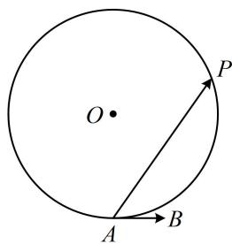
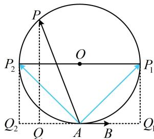

> [!faq]- 《第2节 数量积的常见几何方法》例题解析
>
> > [!success]- **【答案】** $[-2,2]$
>
> > [!note]- **【分析】**
> > 本题未单列分析。
>
> > [!note]- **【解析】**
> > 解析：数量积中的 $\overrightarrow{AB}$ 不变, 符合投影法的使用场景, 如图, 只需分析 $\overrightarrow{AP}$ 在 $\overrightarrow{AB}$ 上的投影向量 $\overrightarrow{AQ}$ , 如图, 当 $P$ 与 $P_{1}$ 重合时, $\overrightarrow{AP}$ 在 $\overrightarrow{AB}$ 上的投影向量为 $\overrightarrow{AQ_{1}}$ ,
> >
> > 
> >
> > 此时投影向量与 $\overrightarrow{AB}$ 同向且长度最大，
> >
> > 所以 $(\overrightarrow{AB} \cdot \overrightarrow{AP})_{\max} = \overrightarrow{AB} \cdot \overrightarrow{AQ_1} = |\overrightarrow{AB}| \cdot |\overrightarrow{AQ_1}| = 1 \times 2 = 2$
> >
> > 当 $P$ 与 $P_{2}$ 重合时， $\overrightarrow{AP}$ 在 $\overrightarrow{AB}$ 上的投影向量为 $\overrightarrow{AQ_2}$
> >
> > 此时投影向量与 $\overrightarrow{AB}$ 反向且长度最大，
> >
> > 所以 $(\overrightarrow{AB}\cdot \overrightarrow{AP})_{\min} = \overrightarrow{AB}\cdot \overrightarrow{AQ_2} = |\overrightarrow{AB} |\cdot |\overrightarrow{AQ_2} |\cdot \cos \pi = 1\times 2\times (-1) = -2$
> >
> > 
> >
> > 故 $\overrightarrow{AB} \cdot \overrightarrow{AP}$ 的取值范围是 $[-2, 2]$ .
