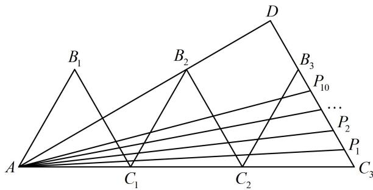

> [!faq]- 《第2节 数量积的常见几何方法》例题解析
>
> > [!success]- **【答案】** A
>
> > [!note]- **【分析】**
> > 本题未单列分析。
>
> > [!note]- **【解析】**
> > 解析：$\overrightarrow{AB_{2}} \cdot \overrightarrow{AP_{i}}$ 中 $\overrightarrow{AB_{2}}$ 固定不变, 故考虑用投影法求 $\overrightarrow{AB_{2}} \cdot \overrightarrow{AP_{i}}$ 的值, 先看 $\overrightarrow{AP_{i}}$ 在 $\overrightarrow{AB_{2}}$ 上的投影向量,
> >
> > 如图，延长 $AB_{2}$ 和 $C_3B_3$ 交于点 $D$ ， $\angle B_{2}C_{1}C_{2} = 60^{\circ}\Rightarrow \angle B_{2}C_{1}A = 120^{\circ}$ ，结合 $\left|AC_1\right| = \left|C_1B_2\right|$ 可得 $\angle C_1AB_2 = 30^\circ$ 又 $\angle DC_3A = 60^\circ$ ，所以 $\angle ADC_3 = 90^\circ$ ，故 $\overrightarrow{AP_i}(i = 1,2,\dots ,10)$ 在 $\overrightarrow{AB_2}$ 上的投影向量都是 $\overrightarrow{AD}$ ，只需求 $\overrightarrow{AB_2}\cdot \overrightarrow{AD}$ $\angle B_2C_2A = \angle DC_3A = 60^\circ \Rightarrow B_2C_2 / / C_3D$ ，所以 $AB_{2}\perp B_{2}C_{2}$ ，故 $\left|AB_2\right| = \sqrt{\left|AC_2\right|^2 - \left|B_2C_2\right|^2} = 2\sqrt{3}$
> >
> > 因为 $\left|AC_{3}\right|=6$ ，所以 $\left|\overrightarrow{AD}\right|=\left|AC_{3}\right|\cos\angle DAC_{3}=6\cos30^{\circ}=3\sqrt{3}$ ，故 $\overrightarrow{AB_{2}}\cdot\overrightarrow{AD}=\left|\overrightarrow{AB_{2}}\right|\cdot\left|\overrightarrow{AD}\right|=2\sqrt{3}\times3\sqrt{3}=18$ ，
> > 所以 $m_{1} + m_{2} + \cdots + m_{10} = 10 \times 18 = 180$ .
> >
> >
> > 
>
> > [!tip]- **【总结】**
> > 当两个向量一个不变，另一个在该向量上的投影向量容易分析时，可用投影法求数量积.
