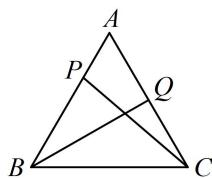

> [!faq]- 《第2节 数量积的常见几何方法》例题解析
>
> > [!success]- **【答案】** -1
>
> > [!note]- **【分析】**
> > 本题未单列分析。
>
> > [!note]- **【解析】**
> > 解析：$\overrightarrow{AB}$ 和 $\overrightarrow{AC}$ 知道长度和夹角，可尝试拆解法，选它们为基底来表示 $\overrightarrow{CP}$ 和 $\overrightarrow{BQ}$ ，由题意， $\overrightarrow{CP} = \overrightarrow{CA} + \overrightarrow{AP} = -\overrightarrow{AC} + \frac{1}{3}\overrightarrow{AB}$ ， $\overrightarrow{BQ} = \overrightarrow{BA} + \overrightarrow{AQ} = -\overrightarrow{AB} + \frac{1}{2}\overrightarrow{AC}$ ，所以 $\overrightarrow{CP} \cdot \overrightarrow{BQ} = \left(-\overrightarrow{AC} + \frac{1}{3}\overrightarrow{AB}\right) \cdot \left(-\overrightarrow{AB} + \frac{1}{2}\overrightarrow{AC}\right) = -\frac{1}{3}\overrightarrow{AB}^2 + \frac{7}{6}\overrightarrow{AB} \cdot \overrightarrow{AC} - \frac{1}{2}\overrightarrow{AC}^2 = -\frac{1}{3} \times 2^2 + \frac{7}{6} \times 2 \times 2 \times \cos 60^\circ - \frac{1}{2} \times 2^2 = -1.$
> >
> > 
>
> > [!tip]- **【反思】**
> > 拆解法的核心是选择两个既知道长度又知道夹角的向量作为基底，一般会往特殊图形的边上进行拆解（注意，不是绝对）.
