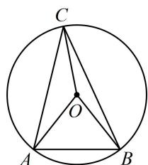

> [!faq]- 《第2节 数量积的常见几何方法》例题解析
>
> > [!success]- **【答案】** C
>
> > [!note]- **【分析】**
> > 本题未单列分析。
>
> > [!note]- **【解析】**
> > A. 0 B. 1 C. 3 D. 5
> >
> > 解析： $\triangle ABC$ 已知一角及对边，其外接圆半径可求，故把涉及的向量全部往 $\overrightarrow{OA}$ ， $\overrightarrow{OB}$ ， $\overrightarrow{OC}$ 转化，
> >
> > 如图，设 $\triangle ABC$ 外接圆半径为 $r$ ，由正弦定理， $\frac{AB}{\sin\angle ACB} = 2 = 2r\Rightarrow r = 1$ ，所以 $\left|\overrightarrow{OA}\right| = \left|\overrightarrow{OB}\right| = \left|\overrightarrow{OC}\right| = 1$
> >
> > $$
> > \overrightarrow {O C} \cdot \overrightarrow {A B} + \overrightarrow {C A} \cdot \overrightarrow {C B} = \overrightarrow {O C} \cdot (\overrightarrow {O B} - \overrightarrow {O A}) + (\overrightarrow {O A} - \overrightarrow {O C}) \cdot (\overrightarrow {O B} - \overrightarrow {O C})
> > $$
> >
> > $$
> > = \overrightarrow {O C} \cdot \overrightarrow {O B} - \overrightarrow {O C} \cdot \overrightarrow {O A} + \overrightarrow {O A} \cdot \overrightarrow {O B} - \overrightarrow {O A} \cdot \overrightarrow {O C} - \overrightarrow {O C} \cdot \overrightarrow {O B} + \overrightarrow {O C} ^ {2}
> > $$
> >
> > $$
> > = - 2 \overrightarrow {O C} \cdot \overrightarrow {O A} + \overrightarrow {O A} \cdot \overrightarrow {O B} + \overrightarrow {O C} ^ {2} = - 2 \cos \angle A O C + \cos \angle A O B + 1 \tag {①}
> > $$
> >
> > 因为 $\angle ACB = \frac{\pi}{4}$ ，所以 $\angle AOB = 2\angle ACB = \frac{\pi}{2}$ ，故 $\cos \angle AOB = \cos \frac{\pi}{2} = 0$ ，
> >
> > 代入①得： $\overrightarrow{OC}\cdot \overrightarrow{AB} +\overrightarrow{CA}\cdot \overrightarrow{CB} = 1 - 2\cos \angle AOC$
> >
> > 所以当 $\angle AOC = \pi$ 时， $\overrightarrow{OC} \cdot \overrightarrow{AB} + \overrightarrow{CA} \cdot \overrightarrow{CB}$ 取得最大值3.
> >
> > 
>
> > [!tip]- **【反思】**
> > 圆中求数量积，如考虑拆解法，常选择分解为半径对应向量.
