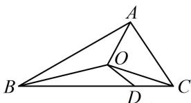

<!-- question-source:start -->
3. (2022·安徽芜湖模拟·★★★)

如图，O 是 $\triangle ABC$ 的重心，D 是边 BC 上一点，且 $\overrightarrow{BD}=3\overrightarrow{DC}$ ， $\overrightarrow{OD}=\lambda\overrightarrow{AB}+\mu\overrightarrow{AC}$ ，则 $\frac{\lambda}{\mu}=$ （）
A. $-\frac{1}{5}$ B. $-\frac{1}{4}$ C. $\frac{1}{5}$ D. $\frac{1}{4}$

<!-- question-source:end -->

![[Q00050353A1]]
