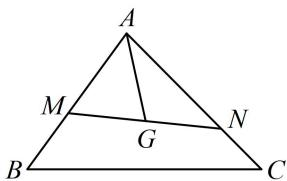

<!-- question-source:start -->
7. (2022·重庆模拟·★★★☆)

如图，已知点 $G$ 是 $\triangle ABC$ 的重心，过点 $G$ 作直线分别与 $AB$ ， $AC$ 两边交于 $M$ ， $N$ 两点（ $M$ ， $N$ 与 $B$ ， $C$ 不重合），设 $\overrightarrow{AB} = x\overrightarrow{AM}$ ， $\overrightarrow{AC} = y\overrightarrow{AN}$ ，则 $\frac{1}{x + 1} +\frac{1}{y + 1}$ 的最小值为（）A. $\frac{1}{2}$ B. $\frac{2}{3}$ C. $\frac{3}{4}$ D. $\frac{4}{5}$

<!-- question-source:end -->

![[Q00050357A1]]
