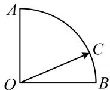

<!-- question-source:start -->
## 9. (★★★)

如图，在扇形 OAB 中， $\angle AOB = 90^{\circ}$ ，C 为弧 AB 上的一个动点，若 $\overrightarrow{OC} = x\overrightarrow{OA} + y\overrightarrow{OB}$ ，则 $x + y$ 的最大值是 \_\_\_\_.

<!-- question-source:end -->

![[Q00050853A1]]
