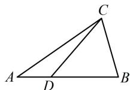

> [!faq]- 《第3节 向量的分解与共线性质》参考答案
>
> > [!success]- **【答案】** B
>
> > [!note]- **【分析】**
> > 本题未单列分析。
>
> > [!note]- **【解析】**
> > B
> > 解法 1：如图，由题意， $\overrightarrow{CB}=\overrightarrow{CA}+\overrightarrow{AB}=\overrightarrow{CA}+3\overrightarrow{AD}=$ $\overrightarrow{CA}+3(\overrightarrow{CD}-\overrightarrow{CA})=-2\overrightarrow{CA}+3\overrightarrow{CD}=-2m+3n$ .
> > 解法 2：由题意， $\overrightarrow{AD}=\frac{1}{3}\overrightarrow{AB}$ ，根据内容提要第 2 点的结论②， $\overrightarrow{CD}=\left(1-\frac{1}{3}\right)\overrightarrow{CA}+\frac{1}{3}\overrightarrow{CB}=\frac{2}{3}\overrightarrow{CA}+\frac{1}{3}\overrightarrow{CB}$ 所以 $\overrightarrow{CB} = -2\overrightarrow{CA} + 3\overrightarrow{CD} = -2m + 3n$ .
> >
> > 
