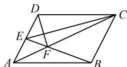

> [!faq]- 《第3节 向量的分解与共线性质》参考答案
>
> > [!success]- **【答案】** B
>
> > [!note]- **【分析】**
> > 本题未单列分析。
>
> > [!note]- **【解析】**
> > B
> >
> > 解析：如图，从 $D$ 到 $F$ ，与基底 $\overrightarrow{AB}$ ， $\overrightarrow{AD}$ 关联较强的路径可选 $D\to A\to F$ 由题意， $\overrightarrow{DF} = \overrightarrow{DA} +\overrightarrow{AF} = -\overrightarrow{AD} +\overrightarrow{AF}$ ①，还需把 $\overrightarrow{AF}$ 也用基底表示，先分析 $F$ 在 $AC$ 上的位置，由图可知 $\triangle AEF\sim \triangle CBF$ ，所以 $\frac{AF}{CF} = \frac{AE}{BC} = \frac{1}{2}$ 故 $\overrightarrow{AF} = \frac{1}{3}\overrightarrow{AC} = \frac{1}{3} (\overrightarrow{AB} +\overrightarrow{AD})$ ，代入①整理得： $\overrightarrow{DF} = \frac{1}{3}\overrightarrow{AB} -\frac{2}{3}\overrightarrow{AD}$
> >
> > 
