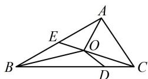

> [!faq]- 《第3节 向量的分解与共线性质》参考答案
>
> > [!success]- **【答案】** A
>
> > [!note]- **【分析】**
> > 本题未单列分析。
>
> > [!note]- **【解析】**
> > A
> >
> > 解析： $\overrightarrow{OD} = \overrightarrow{OC} +\overrightarrow{CD} = \overrightarrow{OC} +\frac{1}{4}\overrightarrow{CB} = \overrightarrow{OC} +\frac{1}{4}\overrightarrow{AB} -\frac{1}{4}\overrightarrow{AC}$ ①，
> >
> > 还需把 $\overrightarrow{OC}$ 用基底表示，可用重心分中线比例来完成，  
> > 如图，延长 $CO$ 交 $AB$ 于 $E$ ，则 $E$ 为 $AB$ 中点，  
> > 且 $\overrightarrow{CO} = \frac{2}{3}\overrightarrow{CE} = \frac{2}{3}\times \frac{1}{2} (\overrightarrow{CA} +\overrightarrow{CB}) = \frac{1}{3}\overrightarrow{CA} +\frac{1}{3}\overrightarrow{CB}$ $= -\frac{1}{3}\overrightarrow{AC} +\frac{1}{3} (\overrightarrow{AB} -\overrightarrow{AC}) = \frac{1}{3}\overrightarrow{AB} -\frac{2}{3}\overrightarrow{AC},$ 所以 $\overrightarrow{OC} = -\overrightarrow{CO} = -\frac{1}{3}\overrightarrow{AB} +\frac{2}{3}\overrightarrow{AC}$ ，代入①得 $\overrightarrow{OD} = \left(-\frac{1}{3}\overrightarrow{AB} +\frac{2}{3}\overrightarrow{AC}\right) + \frac{1}{4}\overrightarrow{AB} -\frac{1}{4}\overrightarrow{AC} = -\frac{1}{12}\overrightarrow{AB} +\frac{5}{12}\overrightarrow{AC},$ 又 $\overrightarrow{OD} = \lambda \overrightarrow{AB} +\mu \overrightarrow{AC}$ ，所以 $\lambda = -\frac{1}{12}$ ， $\mu = \frac{5}{12}$ ，故 $\frac{\lambda}{\mu} = -\frac{1}{5}$
> >
> > 
>
> > [!tip]- **【反思】**
> > 设 O 为 $\triangle ABC$ 的重心，则 $\overrightarrow{AO} = \frac{1}{3} \overrightarrow{AB} + \frac{1}{3} \overrightarrow{AC}$ .
