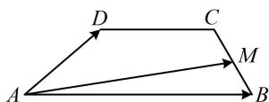

> [!faq]- 《第3节 向量的分解与共线性质》参考答案
>
> > [!success]- **【答案】** D
>
> > [!note]- **【分析】**
> > 本题未单列分析。
>
> > [!note]- **【解析】**
> > D
> > 解析：观察选项发现目标是把 $\overrightarrow{AM}$ 用 $\overrightarrow{AB}$ 和 $\overrightarrow{AD}$ 表示，从 A 到 M，与基底 $\{\overrightarrow{AB},\overrightarrow{AD}\}$ 关联较强的路径是 $A\to B\to M$ ，如图，由题意， $\overrightarrow{AM}=\overrightarrow{AB}+\overrightarrow{BM}=\overrightarrow{AB}+\frac{1}{2}\overrightarrow{BC}$ $=\overrightarrow{AB}+\frac{1}{2}(\overrightarrow{BA}+\overrightarrow{AD}+\overrightarrow{DC})=\overrightarrow{AB}-\frac{1}{2}\overrightarrow{AB}+\frac{1}{2}\overrightarrow{AD}+\frac{1}{2}\overrightarrow{DC}$ $=\frac{1}{2}\overrightarrow{AB}+\frac{1}{2}\overrightarrow{AD}+\frac{1}{2}\times\frac{1}{2}\overrightarrow{AB}=\frac{3}{4}\overrightarrow{AB}+\frac{1}{2}\overrightarrow{AD}$
> >
> > 
> >
> > 已知 $\triangle ABC$ 内接于圆 $O$ , $\left|\overrightarrow{CA} + \overrightarrow{CB}\right| = \left|\overrightarrow{CA} - \overrightarrow{CB}\right|$ , 若 $P$ 为线段 $OC$ 的中点, 则 $\overrightarrow{OP} = (\quad)$ A. $\frac{1}{3}\overrightarrow{AC} - \frac{1}{2}\overrightarrow{AB}$ B. $\frac{1}{4}\overrightarrow{AC} - \frac{1}{2}\overrightarrow{AB}$ C. $\frac{1}{2}\overrightarrow{AC} - \frac{1}{4}\overrightarrow{AB}$ D. $\frac{1}{2}\overrightarrow{AC} - \frac{1}{3}\overrightarrow{AB}$
