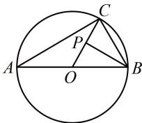

> [!faq]- 《第3节 向量的分解与共线性质》参考答案
>
> > [!success]- **【答案】** C
>
> > [!note]- **【分析】**
> > 本题未单列分析。
>
> > [!note]- **【解析】**
> > C
> >
> > 解析：给出了模的关系，想到将其平方，去掉模再看， $\left|\overrightarrow{CA}+\overrightarrow{CB}\right|=\left|\overrightarrow{CA}-\overrightarrow{CB}\right|\Rightarrow\left|\overrightarrow{CA}+\overrightarrow{CB}\right|^{2}=\left|\overrightarrow{CA}-\overrightarrow{CB}\right|^{2}$ 所以 $\overrightarrow{CA}^{2} + \overrightarrow{CB}^{2} + 2\overrightarrow{CA} \cdot \overrightarrow{CB} = \overrightarrow{CA}^{2} + \overrightarrow{CB}^{2} - 2\overrightarrow{CA} \cdot \overrightarrow{CB}$ 从而 $\overrightarrow{CA} \cdot \overrightarrow{CB} = 0$ ，故 $CA \perp CB$ 所以 AB 是圆 O 的直径，O 即为 AB 中点，如图，
> > 故 $\overrightarrow{OP} = -\frac{1}{2}\overrightarrow{CO} = -\frac{1}{2} \times \frac{1}{2} (\overrightarrow{CA} + \overrightarrow{CB}) = -\frac{1}{4}\overrightarrow{CA} - \frac{1}{4}\overrightarrow{CB}$ $=\frac{1}{4}\overrightarrow{AC}-\frac{1}{4}(\overrightarrow{AB}-\overrightarrow{AC})=\frac{1}{2}\overrightarrow{AC}-\frac{1}{4}\overrightarrow{AB}$
> >
> > 
