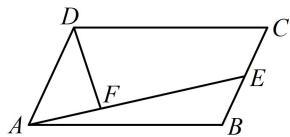

> [!faq]- 《第3节 向量的分解与共线性质》参考答案
>
> > [!success]- **【答案】** A
>
> > [!note]- **【分析】**
> > 本题未单列分析。
>
> > [!note]- **【解析】**
> > (2023·江苏省苏北七市二调·★★★)
> >
> > 在 $\square ABCD$ 中， $\overrightarrow{BE} = \frac{1}{2}\overrightarrow{BC}$ ， $\overrightarrow{AF} = \frac{1}{3}\overrightarrow{AE}$ ，若 $\overrightarrow{AB} = m\overrightarrow{DF} + n\overrightarrow{AE}$ ，则 $m + n = (\quad)$ A. $\frac{1}{2}$ B. $\frac{3}{4}$ C. $\frac{5}{6}$ D. $\frac{4}{3}$
> >
> > 解析：直接将 $\overrightarrow{AB}$ 用 $\overrightarrow{DF}$ 和 $\overrightarrow{AE}$ 表示较难，在 $\square ABCD$ 中，用 $\overrightarrow{AB}$ 和 $\overrightarrow{AD}$ 表示其它向量更容易，故把它们作为基底表示 $\overrightarrow{DF}$ 和 $\overrightarrow{AE}$ ，代回原条件等式，通过对比系数求 $m, n$ ，如图， $\overrightarrow{DF} = \overrightarrow{DA} + \overrightarrow{AF} = -\overrightarrow{AD} + \frac{1}{3}\overrightarrow{AE} = -\overrightarrow{AD} + \frac{1}{3} (\overrightarrow{AB} + \overrightarrow{BE}) = -\overrightarrow{AD} + \frac{1}{3} (\overrightarrow{AB} + \overrightarrow{AE})$ ，因为 $\overrightarrow{AB} = m\overrightarrow{DF} + n\overrightarrow{AE}$ ，所以 $\overrightarrow{AB} = m\left(\frac{1}{3}\overrightarrow{AB} - \frac{5}{6}\overrightarrow{AD}\right) + n\left(\overrightarrow{AB} + \frac{1}{2}\overrightarrow{AD}\right) = \left(\frac{m}{3} + n\right)\overrightarrow{AB} + \left(\frac{n}{2} - \frac{5m}{6}\right)\overrightarrow{AD}$ ，比较左右两边系数可得 $\left\{\frac{m}{3} + n = 1, \frac{n}{2} - \frac{5m}{6} = 0\right.$ ，解得： $m = \frac{1}{2}, n = \frac{5}{6}$ ，所以 $m + n = \frac{4}{3}$ .
> >
> > 
