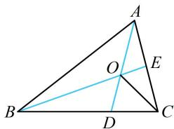

> [!faq]- 《第3节 向量的分解与共线性质》参考答案
>
> > [!success]- **【答案】** ## 8. (2023·江苏省苏锡常镇四市一模·★★★☆) $$ \triangle A B C $$ $$ \overrightarrow {B D} = 2 \overrightarrow {D C}, \overrightarrow {C E} = \overrightarrow {E A} $$ $$ \overrightarrow {C O} = x \overrightarrow {C B} + y \overrightarrow {C A} (x, y \in \mathbf {R}) $$ $$ \frac {3}{5} $$ $$ x + y = $$
>
> > [!note]- **【分析】**
> > 本题未单列分析。
>
> > [!note]- **【解析】**
> > 解析：肯定不好通过将 $\overrightarrow{CO}$ 直接分解为 $\overrightarrow{CB}$ 和 $\overrightarrow{CA}$ 来求 $x + y$ ，故想办法列出关于 $x, y$ 的方程，观察发现由 $A, O, D$ 共线可以得到一个，利用 $B, O, E$ 共线又可得到一个， $x, y$ 便可直接解出来了，因为 $\overrightarrow{BD} = 2\overrightarrow{DC}$ ，所以 $\overrightarrow{CB} = 3\overrightarrow{CD}$ ，代入 $\overrightarrow{CO} = x\overrightarrow{CB} + y\overrightarrow{CA}$ 可得 $\overrightarrow{CO} = 3x\overrightarrow{CD} + y\overrightarrow{CA}$ ，因为 $A, O, D$ 共线，所以由三点共线系数和结论， $3x + y = 1$ ①，同理，由 $\overrightarrow{CE} = \overrightarrow{EA}$ 可得 $\overrightarrow{CA} = 2\overrightarrow{CE}$ ，代入 $\overrightarrow{CO} = x\overrightarrow{CB} + y\overrightarrow{CA}$ 可得 $\overrightarrow{CO} = x\overrightarrow{CB} + 2y\overrightarrow{CE}$ ，
> >
> > 结合 B, O, E 三点共线可得 $x + 2y = 1$ ②,
> >
> > 联立①②解得： $x=\frac{1}{5}$ ， $y=\frac{2}{5}$ ，所以 $x+y=\frac{3}{5}$ .
> >
> > 
> >
> > ## 类型Ⅱ：等和线的运用
