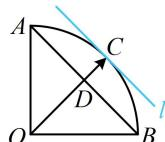

> [!faq]- 《第3节 向量的分解与共线性质》参考答案
>
> > [!success]- **【答案】** $\sqrt{2}$
>
> > [!note]- **【分析】**
> > 本题未单列分析。
>
> > [!note]- **【解析】**
> > 解析：涉及基底表示的系数和问题，考虑用等和线处理，先连接基向量终点，找到系数和为1的等和线，
> >
> > 如图，连接 $AB$ ，则 $AB$ 是和为1的等和线，设 $l$ 是与 $AB$ 平行且与圆弧相切的直线，
> >
> > 由等和线定理，当 $C$ 恰为切点时， $C$ 离等和线 $AB$ 最远，
> >
> > 此时 $x + y$ 最大，设 $OC$ 与 $AB$ 交于点 $D$ ，则 $OD \perp AB$
> >
> > 不妨设 $|OA| = |OB| = |OC| = 2$ ，则 $|OD| = \sqrt{2}$ ，
> >
> > 所以 $(x + y)_{\max} = \frac{|OC|}{|OD|} = \frac{2}{\sqrt{2}} = \sqrt{2}$
> >
> > 
