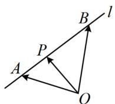
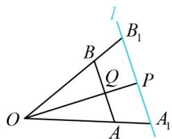
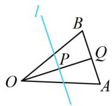
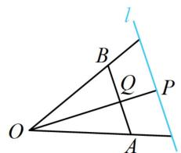
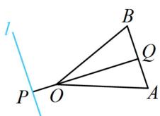

<!-- source-part:1 pages:1-7 -->

# 第 3 节 向量的分解与共线性质（★★★）

## 内容提要

本节归纳与平面向量基底表示有关的题型，下面先梳理涉及到的一些知识和结论.

1. 平面向量基本定理: 设 $a, b$ 是平面内两个不共线的向量, 则它们可以作为平面的一组基底 (其中 $a, b$ 叫做基向量), 对平面内任意一个向量 $p$ , 都存在唯一的一对实数 $x, y$ , 使 $p = xa + yb$ .

2. 三点共线的充要条件: 如图1, $A$ , $B$ 是直线 $l$ 上不同的两点, $O$ 是直线 $l$ 外一点, 对于平面内任意的点 $P$ , 若 $\overrightarrow{OP} = x\overrightarrow{OA} + y\overrightarrow{OB}$ , 则 $A$ , $B$ , $P$ 三点共线的充要条件是 $x + y = 1$ .

①特别地，当 $P$ 为 $AB$ 中点时， $x = y = \frac{1}{2}$ ，即 $\overrightarrow{OP} = \frac{1}{2}\overrightarrow{OA} + \frac{1}{2}\overrightarrow{OB}$ ，我们把这一结论称为向量中线定理.

② 若已知 $A, B, P$ 共线，且 $\overrightarrow{AP} = y\overrightarrow{AB}$ ，则 $\overrightarrow{OP} = (1 - y)\overrightarrow{OA} + y\overrightarrow{OB}$ ，用此结论可快速找到把 $\overrightarrow{OP}$ 用 $\overrightarrow{OA}$ 和 $\overrightarrow{OB}$ 表示的系数.

3. 等和线定理: $\overrightarrow{OA}$ 和 $\overrightarrow{OB}$ 构成平面的一组基底, 对于平面内的向量 $\overrightarrow{OP}$ , 设 $\overrightarrow{OP} = \lambda \overrightarrow{OA} + \mu \overrightarrow{OB} (\lambda, \mu \in \mathbf{R})$ , 若点 $P$ 在直线 $AB$ 或 $AB$ 的平行线上运动, 则 $\lambda + \mu$ 为定值, 反之也成立. 如图2, 我们把直线 $AB$ 及 $AB$ 的平行线 $l$ 称为等和线. 记 $\lambda + \mu = k$ , 则 $|k| = \frac{|OP|}{|OQ|} = \frac{|OA_1|}{|OA|} = \frac{|OB_1|}{|OB|}$ .

①当等和线 $l$ 恰为直线 $AB$ 时， $k = 1$ ，此时 $A, P, B$ 三点共线，如图1；

②当等和线 l 在 O 与直线 AB 之间时，0 < k < 1，如图 3；

③当直线 $AB$ 在点 $O$ 与等和线 $l$ 之间时， $k > 1$ ，如图4；

④当等和线 l 过点 O 时，k=0；

⑤若点 O 在直线 AB 与等和线 l 之间，则 k < 0，如图 5.

  
图1

  
图2

  
图3

  
图4

  
图5

![[高中/总复习/教辅/一数常规版2026/第6章 平面向量/第3节 向量的分解与共线性质/类型01_平面向量的基底表示/类型01_平面向量的基底表示.md]]
![[高中/总复习/教辅/一数常规版2026/第6章 平面向量/第3节 向量的分解与共线性质/类型02_三点共线定理的应用/类型02_三点共线定理的应用.md]]
![[高中/总复习/教辅/一数常规版2026/第6章 平面向量/第3节 向量的分解与共线性质/类型03_等和线的应用/类型03_等和线的应用.md]]
![[高中/总复习/教辅/一数常规版2026/第6章 平面向量/第3节 向量的分解与共线性质/强化训练/强化训练.md]]
