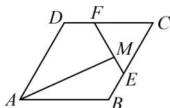

<!-- question-source:start -->
【变式1】如图，在平行四边形ABCD中，E，F分别为BC，CD上的点， $\overrightarrow{CE} = 2\overrightarrow{EB}$ ， $\overrightarrow{CF} = 2\overrightarrow{FD}$ ，若线段EF上存在一点M，使 $\overrightarrow{AM} = x\overrightarrow{AB} + \frac{1}{2}\overrightarrow{AD}$ ( $x \in \mathbf{R}$ )，则 $x =$ \_\_\_\_.

<!-- question-source:end -->

![[高中/总复习/教辅/一数常规版2026/第6章 平面向量/第3节 向量的分解与共线性质/类型01_平面向量的基底表示/例题/answers/Q00050344A1.md]]
