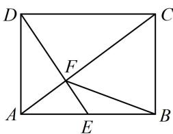

> [!faq]- 《第3节 向量的分解与共线性质》例题解析
>
> > [!success]- **【答案】** D
>
> > [!note]- **【分析】**
> > 本题未单列分析。
>
> > [!note]- **【解析】**
> > 解析：如图， $\overrightarrow{BF} = \overrightarrow{BA} +\overrightarrow{AF} = -\overrightarrow{AB} +\overrightarrow{AF}$ ①，要进一步把 $\overrightarrow{AF}$ 化为基底，需分析 $F$ 在 $AC$ 上的位置，由 $\triangle AEF\sim \triangle CDF$ 可得 $\frac{|AF|}{|FC|} = \frac{|AE|}{|CD|} = \frac{1}{2}$ ，所以 $\overrightarrow{AF} = \frac{1}{3}\overrightarrow{AC} = \frac{1}{3} (\overrightarrow{AB} +\overrightarrow{AD})$ 代入 $①$ 可得 $\overrightarrow{BF} = -\frac{2}{3}\overrightarrow{AB} +\frac{1}{3}\overrightarrow{AD}.$
> >
> > 
>
> > [!tip]- **【反思】**
> > 向量按基底分解的原则是尽量往容易化基底的向量转化，例如 $\overrightarrow{BF}$ 还可按 $\overrightarrow{BC} +\overrightarrow{CF}$ 等方式来化
