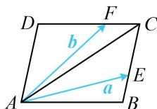

> [!faq]- 《第3节 向量的分解与共线性质》例题解析
>
> > [!success]- **【答案】** B
>
> > [!note]- **【分析】**
> > 本题未单列分析。
>
> > [!note]- **【解析】**
> > 解析：如图，直接用 $a$ ， $b$ 表示 $\overrightarrow{AC}$ 较难，考虑换基底，注意到用 $\overrightarrow{AB}$ ， $\overrightarrow{AD}$ 容易表示其它向量，故若设 $\overrightarrow{AC} = xa + yb$ ，则只要把 $a$ 和 $b$ 也用 $\overrightarrow{AB}$ ， $\overrightarrow{AD}$ 表示，就能与 $\overrightarrow{AC} = \overrightarrow{AB} + \overrightarrow{AD}$ 比较系数，求出 $x, y$ ，
> >
> > 设 $\overrightarrow{AC} = x\pmb{a} + y\pmb{b}$ ，由题意， $\pmb{a} = \overrightarrow{AE} = \overrightarrow{AB} + \overrightarrow{BE} = \overrightarrow{AB} + \frac{1}{3}\overrightarrow{AD}$ ， $\pmb{b} = \overrightarrow{AF} = \overrightarrow{AD} + \overrightarrow{DF} = \overrightarrow{AD} + \frac{2}{3}\overrightarrow{AB}$ ，所以 $\overrightarrow{AC} = x\left(\overrightarrow{AB} + \frac{1}{3}\overrightarrow{AD}\right) + y\left(\overrightarrow{AD} + \frac{2}{3}\overrightarrow{AB}\right) = \left(x + \frac{2y}{3}\right)\overrightarrow{AB} + \left(\frac{x}{3} + y\right)\overrightarrow{AD}$ ①，
> >
> > $$
> > \overrightarrow {A C} = \overrightarrow {A B} + \overrightarrow {A D}
> > $$
> >
> > 与①比较可得 $\left\{\begin{aligned}x+\frac{2y}{3}&=1\\ \frac{x}{3}+y&=1\end{aligned}\right.$ ，解得： $\left\{\begin{aligned}x&=\frac{3}{7}\\ y&=\frac{6}{7}\end{aligned}\right.$ ，所以 $\overrightarrow{AC}=\frac{3}{7}\boldsymbol{a}+\frac{6}{7}\boldsymbol{b}$ .
> >
> > 
>
> > [!tip]- **【反思】**
> > 选择相同基底，按两种方法表示同一向量，通过对比系数构造方程是向量分解问题的一种手段.
