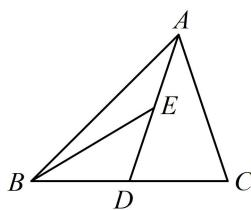

<!-- question-source:start -->
【例 2】如图, 在 $\triangle ABC$ 中, $AD$ 为 $BC$ 边上的中线, $E$ 为 $AD$ 的中点, 则 $\overrightarrow{EB} = (\quad)$

A. $\frac{3}{4}\overrightarrow{AB} -\frac{1}{4}\overrightarrow{AC}$ B. $\frac{1}{4}\overrightarrow{AB} -\frac{3}{4}\overrightarrow{AC}$ C. $\frac{3}{4}\overrightarrow{AB} +\frac{1}{4}\overrightarrow{AC}$ D. $\frac{1}{4}\overrightarrow{AB} +\frac{3}{4}\overrightarrow{AC}$

<!-- question-source:end -->

![[高中/总复习/教辅/一数常规版2026/第6章 平面向量/第3节 向量的分解与共线性质/类型02_三点共线定理的应用/例题/answers/Q00050346A1.md]]
