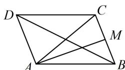

<!-- question-source:start -->
【变式】如图，在平行四边形ABCD中，M是BC的中点，若 $\overrightarrow{AC}=\lambda\overrightarrow{AM}-\mu\overrightarrow{BD}$ ，则 $\lambda+\mu=$ \_\_\_\_.

<!-- question-source:end -->

![[高中/总复习/教辅/一数常规版2026/第6章 平面向量/第3节 向量的分解与共线性质/类型02_三点共线定理的应用/例题/answers/Q00050349A1.md]]
