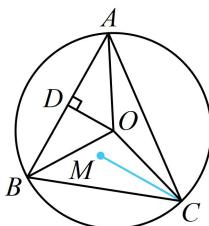

> [!faq]- 《第3节 向量的分解与共线性质》例题解析
>
> > [!success]- **【答案】** C
>
> > [!note]- **【分析】**
> > 本题未单列分析。
>
> > [!note]- **【解析】**
> > 解析：等式涉及的向量起点都是 $O$ ，可两两组合减少项数，例如可将 $\overrightarrow{OA}$ 与 $\overrightarrow{OB}$ 合并， $\overrightarrow{OC}$ 与 $\overrightarrow{OM}$ 合并，
> >
> > 如图，设 $D$ 为 $AB$ 中点，则 $OD \perp AB$ ，且 $\overrightarrow{OA} + \overrightarrow{OB} = 2\overrightarrow{OD}$ 因为 $\overrightarrow{OA} + \overrightarrow{OB} + \overrightarrow{OC} = \overrightarrow{OM}$ ，所以 $2\overrightarrow{OD} + \overrightarrow{OC} = \overrightarrow{OM}$ 故 $2\overrightarrow{OD} = \overrightarrow{OM} - \overrightarrow{OC} = \overrightarrow{CM}$ ，结合 $OD \perp AB$ 可得 $CM \perp AB$ 同理可得 $AM \perp BC$ ， $BM \perp AC$ ，所以 $M$ 是垂心. 答案：C
> >
> > 
>
> > [!tip]- **【总结】**
> > - **①**：图形有中点可考虑使用向量中线定理（如例2）；
> > - **②**：当两个向量共起点时，可以考虑用向量中线定理合并向量，减少向量的个数（如例2的变式）.
