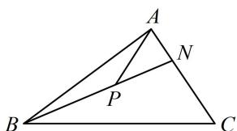

> [!faq]- 《第3节 向量的分解与共线性质》例题解析
>
> > [!success]- **【答案】** D
>
> > [!note]- **【分析】**
> > 本题未单列分析。
>
> > [!note]- **【解析】**
> > 解析：注意到第二个等式共起点A，故若将其中的 $\overrightarrow{AC}$ 换成 $\overrightarrow{AN}$ ，就可用 B, P, N 三点共线构造方程，因为 $\overrightarrow{AN} = \frac{1}{2}\overrightarrow{NC}$ ，所以 $\overrightarrow{AC} = 3\overrightarrow{AN}$ ，代入 $\overrightarrow{AP} = \left(m + \frac{1}{3}\right)\overrightarrow{AB} + \frac{1}{9}\overrightarrow{AC}$ 可得 $\overrightarrow{AP} = \left(m + \frac{1}{3}\right)\overrightarrow{AB} + \frac{1}{3}\overrightarrow{AN}$ ，
> >
> > 因为 $B, P, N$ 三点共线，由内容提要2， $m + \frac{1}{3} + \frac{1}{3} = 1$ ，解得： $m = \frac{1}{3}$ .
> >
> >
> > 
>
> > [!tip]- **【反思】**
> > 向量问题中，可用三点共线的系数和为 1 构造方程，有时需通过转化，让起点相同终点共线.
