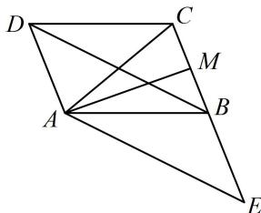

> [!faq]- 《第3节 向量的分解与共线性质》例题解析
>
> > [!success]- **【答案】** 1
>
> > [!note]- **【分析】**
> > 本题未单列分析。
>
> > [!note]- **【解析】**
> > 解析：$\overrightarrow{AC}$ ， $\overrightarrow{AM}$ ， $\overrightarrow{BD}$ 不共起点，但可平移 $\overrightarrow{BD}$ ，使其共起点，再看能否用三点共线结论求系数和，如图，延长 $CB$ 至 $E$ ，使 $CB = BE$ ，则 $BE$ 和 $AD$ 平行且相等，
> >
> > 所以四边形 $ADBE$ 是平行四边形，故 $\overrightarrow{BD} = -\overrightarrow{AE}$
> >
> > 代入 $\overrightarrow{AC} = \lambda \overrightarrow{AM} - \mu \overrightarrow{BD}$ 得 $\overrightarrow{AC} = \lambda \overrightarrow{AM} + \mu \overrightarrow{AE}$ ,
> >
> > 因为 C, M, E 三点共线，所以 $\lambda + \mu = 1$ .
> >
> >
> > 
>
> > [!tip]- **【反思】**
> > 例3是由长度比例化为终点共线，而变式是通过平移使共起点，进而可用共线系数和结论.
