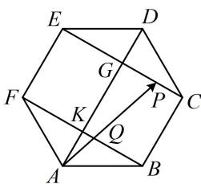

> [!faq]- 《第3节 向量的分解与共线性质》例题解析
>
> > [!success]- **【答案】** 3
>
> > [!note]- **【分析】**
> > 本题未单列分析。
>
> > [!note]- **【解析】**
> > 解析：涉及向量基底表示的系数和问题，常可考虑用等和线速解，先找到系数和为1的等和线，
> >
> > 如图， $BF$ 是系数和为1的等和线，在正六边形中， $CE \parallel BF$ ，所以 $CE$ 也是等和线，
> >
> > 故由内容提要3的等和线定理， $x + y = \frac{|AP|}{|AQ|} = \frac{|AG|}{|AK|}$ ①，
> >
> > 由正六边形几何性质可知 $AD \perp BF$ ，
> >
> > 设 $|AB|=1$ ，则 $|AK|=|AB|\cdot\sin\angle ABK=1\times\sin30^{\circ}=\frac{1}{2}$
> >
> > $\left|AG\right| = \left|AK\right| + \left|KG\right| = \left|AK\right| + \left|EF\right| = \frac{1}{2} + 1 = \frac{3}{2}$ ，所以 $\frac{\left|AG\right|}{\left|AK\right|} = 3$ ，代入①得： $x + y = 3$ 。
> >
> > 
>
> > [!tip]- **【反思】**
> > 基底表示的系数和问题可考虑用等和线速解，其核心是找基向量终点连线的平行线和求相似比.
