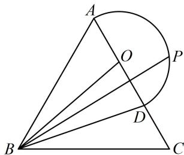

<!-- question-source:start -->
7.（2024·湖南长沙模拟·★★★☆）（多选）

如图所示，在边长为3的等边三角形 $ABC$ 中， $\overrightarrow{AD} = \frac{2}{3}\overrightarrow{AC}$ ，且点 $P$ 在以 $AD$ 中点 $O$ 为圆心， $OA$ 为半径的半圆上， $\overrightarrow{BP} = x\overrightarrow{BA} +y\overrightarrow{BC}$ ，则下列说法正确的是（）A. $\frac{1}{3}\leq x\leq 1$ B. $\overrightarrow{BD} = \frac{1}{3}\overrightarrow{BA} +\frac{2}{3}\overrightarrow{BC}$ C. $\frac{9}{2}\leq \overrightarrow{BP}\cdot \overrightarrow{BC}\leq 9$ D. $x + y$ 的最大值为 $\frac{2\sqrt{3}}{9} +1$

一数·必刷100讲
<!-- question-source:end -->

![[Q00050373A1]]
