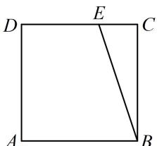

<!-- question-source:start -->
9. (2024·天津卷·★★★☆)

在边长为1的正方形ABCD中，点E为线段CD的三等分点， $CE=\frac{1}{2}DE$ ， $\overrightarrow{BE}=\lambda\overrightarrow{BA}+\mu\overrightarrow{BC}$ ，则 $\lambda+\mu=$ \_\_\_\_；若F为线段BE上的动点，G为AF中点，则 $\overrightarrow{AF}\cdot\overrightarrow{DG}$ 的最小值为\_\_\_\_。

<!-- question-source:end -->

![[Q00050375A1]]
