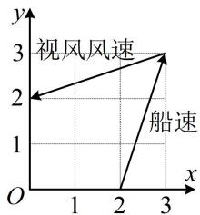

<!-- question-source:start -->
帆船比赛中, 运动员可借助风力计测定风速的大小和方向, 测出的结果在航海学中称为视风风速, 视风风速对应的向量, 是真风风速对应的向量与船行风速对应的向量之和, 其中船行风速对应的向量与船速对应的向量大小相等, 方向相反. 图 1 给出了部分风力等级、名称与风速大小的对应关系. 已知某帆船运动员在某时刻测得的视风风速对应的向量与船速对应的向量如图 2 (风速的大小和向量的大小相同, 单位 $\mathrm{m}/\mathrm{s}$ ), 则真风为 ( )

<table><tr><td>等级</td><td>风速大小(m/s)</td><td>名称</td></tr><tr><td>2</td><td>1.1~3.3</td><td>轻风</td></tr><tr><td>3</td><td>3.4~5.4</td><td>微风</td></tr><tr><td>4</td><td>5.5~7.9</td><td>和风</td></tr><tr><td>5</td><td>8.0~10.1</td><td>劲风</td></tr></table>

图1

  
图2

A. 轻风 B. 微风 C. 和风 D. 劲风
<!-- question-source:end -->

![[Q00051037A1]]
