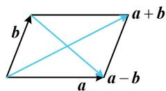

> [!faq]- 《第4节 向量的坐标运算与建系运用》参考答案
>
> > [!success]- **【答案】** 详见解析
>
> > [!note]- **【分析】**
> > 本题未单列分析。
>
> > [!note]- **【解析】**
> > 4
> >
> > 解法1: 有 $a, b$ 的坐标, 可先求 $a + b$ 和 $a - b$ 的坐标, 再用坐标翻译所给的平行条件,
> >
> > 由题意， $\boldsymbol{a} + \boldsymbol{b} = (3,2 + \lambda)$ ， $\boldsymbol{a} - \boldsymbol{b} = (-1,2 - \lambda)$ ，
> >
> > 又 $(\pmb {a} + \pmb {b}) / / (\pmb {a} - \pmb {b})$ ，所以 $3\times (2 - \lambda) = -1\times (2 + \lambda)\Rightarrow \lambda = 4$
> >
> > 解法2: 注意到 $a + b$ 和 $a - b$ 的图形特征比较明显, 故也可考虑直接画图分析,
> >
> > 如图，当 $\pmb{a}$ 与 $\pmb{b}$ 不共线时， $\pmb{a} + \pmb{b}$ 和 $\pmb{a} - \pmb{b}$ 分别为平行四边形的两条对边构成的向量，它们不共线，所以要使 $(\pmb{a} + \pmb{b}) / / (\pmb{a} - \pmb{b})$ 只能 $\pmb{a} / / \pmb{b}$ ，从而 $1 \times \lambda = 2 \times 2$ ，故 $\lambda = 4$ 。
> >
> > 
