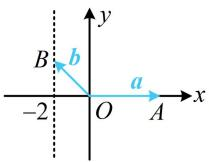
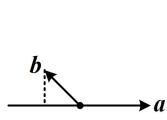

> [!faq]- 《第4节 向量的坐标运算与建系运用》参考答案
>
> > [!success]- **【答案】** 详见解析
>
> > [!note]- **【分析】**
> > 本题未单列分析。
>
> > [!note]- **【解析】**
> > 10
> >
> > 解法1：已知 $|a|$ 和b在a上的投影向量，则a和b容易搬进坐标系，故可建系，用向量的坐标运算来解决问题，如图1，可设 $a=\overrightarrow{OA}=(4,0)$ ， $b=\overrightarrow{OB}$ ，由b在a上的投影向量与a反向且长度为2知B在直线x=-2上运动，所以可设 $b=(-2,y)$ ，其中 $y\in R$ ，
> > 故 $\left|a-3b\right|=\left|(4,0)-3(-2,y)\right|=\left|(10,-3y)\right|=\sqrt{100+9y^{2}}$ 所以当 y=0 时， $|a-3b|$ 取得最小值 10.
> >
> > 解法 2: 所求为模, 也可考虑将模平方, 去掉模再看,
> >
> > 由题意， $\left|a-3b\right|^{2}=a^{2}-6a\cdot b+9b^{2}=16-6a\cdot b+9b^{2}$ ①,
> >
> > 如图2，因为 $\pmb{b}$ 在 $\pmb{a}$ 上的投影向量与 $\pmb{a}$ 反向且长度为2，
> >
> > 所以 $a \cdot b = -4 \times 2 = -8$ ，代入①得 $\left|a - 3b\right|^{2} = 64 + 9b^{2}$ ②，
> >
> > 由图2可知， $|\pmb{b}|$ 不小于 $\pmb{b}$ 在 $\pmb{a}$ 上的投影向量的模，
> >
> > 所以 $|b|\geq2$ ，当b与a反向时取等，如图3，
> >
> > 结合②可得 $\left|a-3b\right|^{2}\geq64+9\times2^{2}=100$ ，
> >
> > 所以 $|a-3b|\geq10$ ，故 $|a-3b|$ 的最小值为10.
> >
> >   
> > 图1
> >
> >   
> > 图2  
> > 图3
