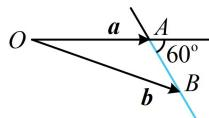

> [!faq]- 《第4节 向量的坐标运算与建系运用》参考答案
>
> > [!success]- **【答案】** C
>
> > [!note]- **【分析】**
> > 本题未单列分析。
>
> > [!note]- **【解析】**
> > 解法1：涉及向量夹角，可考虑夹角余弦公式，
> >
> > 由题意， $\cos <  b - a,a > = \frac{(b - a)\cdot a}{|b - a|\cdot|a|} = \frac{1}{2}$
> >
> > 结合 $|\pmb{a}| = 1$ 可得 $\frac{(\pmb{b} - \pmb{a})\cdot\pmb{a}}{|\pmb{b} - \pmb{a}|} = \frac{1}{2}$ ①，若将 $\pmb{a}$ ， $\pmb{b}$ 搬进坐标系，则容易翻译式①，故可考虑设坐标处理，
> >
> > $$
> > \boldsymbol {a} = (1, 0)
> > $$
> >
> > $$
> > \boldsymbol {b} = (x, y)
> > $$
> >
> > $$
> > \boldsymbol {b} - \boldsymbol {a} = (x - 1, y)
> > $$
> >
> > $$
> > (\boldsymbol {b} - \boldsymbol {a}) \cdot \boldsymbol {a} = x - 1, \quad | \boldsymbol {b} - \boldsymbol {a} | = \sqrt {(x - 1) ^ {2} + y ^ {2}}
> > $$
> >
> > 代入式①可得 $\frac{x - 1}{\sqrt{(x - 1)^2 + y^2}} = \frac{1}{2}$ ②，
> >
> > 化简得： $y^{2} = 3(x - 1)^{2}$ ，所以 $\left|\pmb {b}\right| = \sqrt{x^2 + y^2}$
> >
> > $$
> > = \sqrt {x ^ {2} + 3 (x - 1) ^ {2}} = \sqrt {4 x ^ {2} - 6 x + 3} = \sqrt {4 \left(x - \frac {3}{4}\right) ^ {2} + \frac {3}{4}} \quad ③,
> > $$
> >
> > 还需 $x$ 的范围，才能求 $\vert b\vert$ 的范围，可由式②来看，
> >
> > 由②可得 $x - 1 > 0$ ，所以 $x > 1$
> >
> > 结合③可得 $|\pmb{b}| > \sqrt{4 \times \left(1 - \frac{3}{4}\right)^2 + \frac{3}{4}} = 1$
> >
> > 解法2: $b - a$ 与 $a$ 的位置关系容易用图形表示, 故也可考虑画图分析 $|b|$ 的取值范围,
> >
> > 如图，记 $a = \overrightarrow{OA}$ ， $b = \overrightarrow{OB}$ ，则当点 $B$ 在如图所示的蓝色射线（由 $b\neq a$ 可知不含点 $A$ ）上运动时，满足 $\pmb {b} - \pmb{a}$ 与 $\pmb{a}$ 的夹角为 $60^{\circ}$ ，因为 $\left|\pmb {a}\right| = 1$ ，所以由图可知， $\left|\pmb {b}\right|$ 的取值范围是 $(1, + \infty)$ ：
> >
> > 
