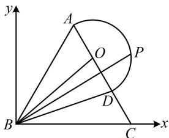

> [!faq]- 《第4节 向量的坐标运算与建系运用》参考答案
>
> > [!success]- **【答案】** BCD
>
> > [!note]- **【分析】**
> > 本题未单列分析。
>
> > [!note]- **【解析】**
> > BCD
> >
> > 解析：涉及圆上动点，可考虑建系，利用圆的方程把动点坐标设为三角形式，结合图形可发现也容易建系，故按此处理，以点B为原点建立如图所示的平面直角坐标系，则 $B(0,0)$ ， $A\left(\frac{3}{2}, \frac{3\sqrt{3}}{2}\right)$ ， $C(3,0)$ ，
> >
> > 
> >
> > 由 $\overrightarrow{AD} = \frac{2}{3}\overrightarrow{AC}$ 可知 $D$ 是 $AC$ 的三等分点，所以 $D\left(\frac{5}{2},\frac{\sqrt{3}}{2}\right)$ ，又因为 $O$ 是 $AD$ 的中点，所以 $O(2,\sqrt{3})$ ，由题意， $P$ 在半圆 $(x - 2)^2 + (y - \sqrt{3})^2 = 1$ 上运动，所以可设 $P(2 + \cos \theta, \sqrt{3} + \sin \theta)$ ，其中 $\theta \in \left[-\frac{\pi}{3}, \frac{2\pi}{3}\right]$ ，A项， $\overrightarrow{BA} = \left(\frac{3}{2}, \frac{3\sqrt{3}}{2}\right)$ ， $\overrightarrow{BC} = (3,0)$ ， $\overrightarrow{BP} = (2 + \cos \theta, \sqrt{3} + \sin \theta)$ ，因为 $\overrightarrow{BP} = x\overrightarrow{BA} + y\overrightarrow{BC}$ ，所以 $\left\{ \begin{array}{l} 2 + \cos \theta = \frac{3}{2}x + 3y \\ \sqrt{3} + \sin \theta = \frac{3\sqrt{3}}{2}x \end{array} \right.$ ，解得： $\left\{ \begin{array}{l} x = \frac{2}{3} + \frac{2\sqrt{3}}{9}\sin \theta \\ y = -\frac{\sqrt{3}}{9}\sin \theta + \frac{1}{3}\cos \theta + \frac{1}{3} \end{array} \right.$ ，
> >
> > 因为 $\theta \in \left[-\frac{\pi}{3},\frac{2\pi}{3}\right]$ ，所以 $\sin \theta \in \left[-\frac{\sqrt{3}}{2},1\right]$
> >
> > 从而 $x = \frac{2}{3} +\frac{2\sqrt{3}}{9}\sin \theta \in \left[\frac{1}{3},\frac{6 + 2\sqrt{3}}{9}\right]$ ，故A项错误；
> >
> > B项， $\overrightarrow{BD} = \overrightarrow{BA} +\overrightarrow{AD} = \overrightarrow{BA} +\frac{2}{3}\overrightarrow{AC} = \overrightarrow{BA} +\frac{2}{3} (\overrightarrow{BC} -\overrightarrow{BA})$
> >
> > $= \frac{1}{3}\overrightarrow{BA} +\frac{2}{3}\overrightarrow{BC}$ ，故B项正确；
> >
> > C 项， $\overrightarrow{BP}\cdot\overrightarrow{BC}=(2+\cos\theta)\cdot3=6+3\cos\theta$
> >
> > 由 $\theta \in \left[-\frac{\pi}{3},\frac{2\pi}{3}\right]$ 得 $\cos \theta \in \left[-\frac{1}{2},1\right]$
> >
> > 所以 $\overrightarrow{BP} \cdot \overrightarrow{BC} = 6 + 3\cos \theta \in \left[\frac{9}{2}, 9\right]$ ，故 C 项正确；
> >
> > D 项， $x + y = \frac{2}{3} + \frac{2\sqrt{3}}{9}\sin\theta - \frac{\sqrt{3}}{9}\sin\theta + \frac{1}{3}\cos\theta + \frac{1}{3}$
> >
> > $$
> > = \frac {\sqrt {3}}{9} \sin \theta + \frac {1}{3} \cos \theta + 1 = \frac {2 \sqrt {3}}{9} \sin \left(\theta + \frac {\pi}{3}\right) + 1,
> > $$
> >
> > $$
> > \theta \in \left[ - \frac {\pi}{3}, \frac {2 \pi}{3} \right] \Rightarrow \theta + \frac {\pi}{3} \in [ 0, \pi ]
> > $$
> >
> > 所以当 $\theta +\frac{\pi}{3} = \frac{\pi}{2}$ 时， $\sin \left(\theta +\frac{\pi}{3}\right)$ 取得最大值1，
> >
> > 此时 $x + y$ 取得最大值 $\frac{2\sqrt{3}}{9} + 1$ ，故D项正确.
