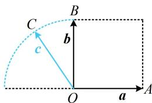
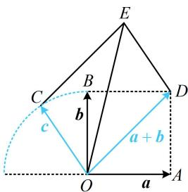

> [!faq]- 《第4节 向量的坐标运算与建系运用》参考答案
>
> > [!success]- **【答案】** 详见解析
>
> > [!note]- **【分析】**
> > 本题未单列分析。
>
> > [!note]- **【解析】**
> > $(1,\sqrt{5})$
> >
> > 解法1: 条件 $f(a \cdot b) + f(b \cdot c) + f(c \cdot a) = 0$ 怎样翻译？注意到 $f(x)$ 的函数值只能是 1, 0 或 -1，所以要使该式成立，则 $f(a \cdot b)$ ， $f(b \cdot c)$ ， $f(c \cdot a)$ 中要么三个都为 0，要么三个分别取 1, 0, -1（顺序可交换），故先分别考虑这两种情况，
> >
> > 若 $f(\pmb {a}\cdot \pmb {b}) = f(\pmb {b}\cdot \pmb {c}) = f(\pmb {c}\cdot \pmb {a}) = 0$ ，则 $\pmb {a}\cdot \pmb {b} = \pmb {b}\cdot \pmb {c} = \pmb {c}\cdot \pmb {a} = 0$ ，于是 $\pmb {a},\pmb {b},\pmb{c}$ 两两垂直，在同一平面上，这不可能，
> >
> > 所以要使 $f(\pmb {a}\cdot \pmb {b}) + f(\pmb {b}\cdot \pmb {c}) + f(\pmb {c}\cdot \pmb {a}) = 0$
> >
> > 只能 $f(\pmb {a}\cdot \pmb{b})$ ， $f(\pmb {b}\cdot \pmb{c})$ ， $f(\pmb {c}\cdot \pmb{a})$ 取遍1，0，-1三个值，
> >
> > 不妨设 $f(\pmb {a}\cdot \pmb {b}) = 0$ ， $f(\pmb {b}\cdot \pmb {c}) = 1$ ， $f(\pmb {c}\cdot \pmb {a}) = -1$
> >
> > 所以 $a \cdot b = 0$ ， $b \cdot c > 0$ ， $c \cdot a < 0$ ，故 $a \perp b$ ，
> >
> > 且 $c$ 与 $\pmb{b}$ 的夹角为锐角， $c$ 与 $\pmb{a}$ 的夹角为钝角，
> >
> > 条件翻译完了, 怎样求 $|a + b + c|$ 的取值范围? 已有 $a, b, c$ 的长度和夹角特征, 可考虑画出图形来观察,
> >
> > 如图1，记 $\overrightarrow{OA} = \boldsymbol{a}$ ， $\overrightarrow{OB} = \boldsymbol{b}$ ， $\overrightarrow{OC} = \boldsymbol{c}$
> >
> > 要使 $c$ 与 $b$ 的夹角为锐角， $c$ 与 $a$ 的夹角为钝角，则点 $C$ 只能在如图所示的四分之一圆上运动（不含端点），要分析的是 $\left|a + b + c\right|$ 的取值范围，于是我们先在图中把 $a + b + c$ 作出来，再看怎样算它，
> >
> > 如图2，以 $OA$ ，OB为邻边作正方形OADB，则 $\pmb {a} + \pmb {b} = \overrightarrow{OD}$
> >
> > 以 $OC$ ，OD为邻边作平行四边形OCED，
> >
> > 则 $a + b + c = \overrightarrow{OD} + \overrightarrow{OC} = \overrightarrow{OE}$ ，设 $\angle COD = \theta$ ，
> >
> > 则 $\theta \in \left(\frac{\pi}{4},\frac{3\pi}{4}\right)$ ，且 $\angle ECO = \pi -\angle COD = \pi -\theta$
> >
> > 在 $\triangle COE$ 中， $CE = OD = \sqrt{2}$ ， $OC = 1$
> >
> > 由余弦定理， $OE^2 = OC^2 +CE^2 -2OC\cdot CE\cdot \cos \angle ECO$
> >
> > $$
> > = 1 ^ {2} + (\sqrt {2}) ^ {2} - 2 \times 1 \times \sqrt {2} \times \cos (\pi - \theta) = 3 + 2 \sqrt {2} \cos \theta \quad ①,
> > $$
> >
> > 因为 $\theta \in \left(\frac{\pi}{4},\frac{3\pi}{4}\right)$ ，所以 $\cos \theta \in \left(-\frac{\sqrt{2}}{2},\frac{\sqrt{2}}{2}\right)$
> >
> > 结合①得 $OE^{2}\in(1,5)$ ，所以 $OE\in(1,\sqrt{5})$ ，
> >
> > 又 $a + b + c = \overrightarrow{OE}$ ，所以 $\left|a + b + c\right|\in (1,\sqrt{5})$
> >
> >   
> > 图1
> >
> >   
> > 图2
> >
> > 解法2：按解法1得到图1后，观察发现图形容易建系，故也可考虑通过建系来分析 $\left|a+b+c\right|$ 的范围，如图3建系，则 $a=(1,0)$ ， $b=(0,1)$ ，
> > 可设 $c=(\cos\alpha,\sin\alpha)$ ，其中 $\alpha\in\left(\frac{\pi}{2},\pi\right)$ ，
> > 则 $a+b+c=(1+\cos\alpha,1+\sin\alpha)$ 所以 $\left|\boldsymbol{a}+\boldsymbol{b}+\boldsymbol{c}\right|=\sqrt{(1+\cos\alpha)^{2}+(1+\sin\alpha)^{2}}$ $=\sqrt{1+2\cos\alpha+\cos^{2}\alpha+1+2\sin\alpha+\sin^{2}\alpha}$ $=\sqrt{3+2(\sin\alpha+\cos\alpha)}=\sqrt{3+2\sqrt{2}\sin\left(\alpha+\frac{\pi}{4}\right)}$ ②，
> > 因为 $\alpha\in\left(\frac{\pi}{2},\pi\right)$ ，所以 $\alpha+\frac{\pi}{4}\in\left(\frac{3\pi}{4},\frac{5\pi}{4}\right)$ ,
> > 故 $\sin\left(\alpha+\frac{\pi}{4}\right)\in\left(-\frac{\sqrt{2}}{2},\frac{\sqrt{2}}{2}\right)$ ,
> > 所以 $3+2\sqrt{2}\sin\left(\alpha+\frac{\pi}{4}\right)\in(1,5)$ 结合②得 $\left|\boldsymbol{a}+\boldsymbol{b}+\boldsymbol{c}\right|\in(1,\sqrt{5})$ .
