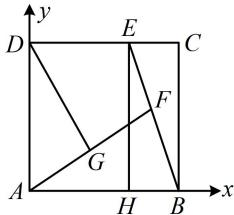
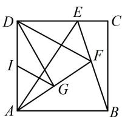

> [!faq]- 《第4节 向量的坐标运算与建系运用》参考答案
>
> > [!success]- **【答案】** 详见解析
>
> > [!note]- **【分析】**
> > 本题未单列分析。
>
> > [!note]- **【解析】**
> > $\frac{4}{3}$ ; $-\frac{5}{18}$
> >
> > 解法1：如图1，设 $EH\perp AB$ 于 $H$ ，则BCEH是矩形，所以 $\overrightarrow{BE} = \overrightarrow{BH} +\overrightarrow{BC} = \frac{1}{3}\overrightarrow{BA} +\overrightarrow{BC}$ ，又 $\overrightarrow{BE} = \lambda \overrightarrow{BA} +\mu \overrightarrow{BC}$ 所以 $\lambda = \frac{1}{3}$ ， $\mu = 1$ ，故 $\lambda +\mu = \frac{4}{3}$
> >
> > 怎样计算 $\overrightarrow{AF} \cdot \overrightarrow{DG}$ ？图形主体是正方形，可考虑建系处理，
> >
> > 如图1建系，则 $B(1,0)$ ， $E\left(\frac{2}{3},1\right)$ ， $A(0,0)$ ， $D(0,1)$
> >
> > 求 $\overrightarrow{AF} \cdot \overrightarrow{DG}$ 关键是求点 $F$ 的坐标，怎样求它？由于 $F$ 在线段 $BE$ 上，故可先写出直线 $BE$ 的方程，由该方程将 $F$ 的坐标设为单变量形式，因为 $k_{BE} = \frac{0 - 1}{1 - \frac{2}{3}} = -3$ ，所以直线 $BE$ 的方程为 $y = -3(x - 1)$ ，即 $y = 3 - 3x$
> >
> > 因为 $F$ 在线段 $BE$ 上，所以可设 $F(x,3 - 3x)$ ， $\frac{2}{3}\leq x\leq 1$
> >
> > 则 $G\left(\frac{x}{2}, \frac{3 - 3x}{2}\right)$ ，所以 $\overrightarrow{AF} = (x, 3 - 3x)$ ， $\overrightarrow{DG} = \left(\frac{x}{2}, \frac{1 - 3x}{2}\right)$ ，
> >
> > $$
> > \overrightarrow {A F} \cdot \overrightarrow {D G} = x \cdot \frac {x}{2} + (3 - 3 x) \cdot \frac {1 - 3 x}{2} = 5 \left(x - \frac {3}{5}\right) ^ {2} - \frac {3}{1 0}
> > $$
> >
> > 因为函数 $g(x) = 5\left(x - \frac{3}{5}\right)^2 -\frac{3}{10}$ 在 $\left[\frac{2}{3},1\right]$ 上 $\nearrow$
> >
> > 所以当 $x = \frac{2}{3}$ 时， $\overrightarrow{AF} \cdot \overrightarrow{DG}$ 取得最小值 $-\frac{5}{18}$ .
> >
> >   
> > 图1
> >
> >   
> > 图2
> >
> > 解法2：求 $\lambda +\mu$ 的过程同解法1，对于 $\overrightarrow{AF}\cdot \overrightarrow{DG}$ ，注意到 $\overrightarrow{AF} = 2\overrightarrow{AG}$ ，故可将其转化为 $2\overrightarrow{AG}\cdot \overrightarrow{DG}$ ，即 $2\overrightarrow{GA}\cdot \overrightarrow{GD}$ ，这是共起点的且底边长已知的数量积，可考虑用极化恒等式计算，如图2，设 $I$ 为 $AD$ 中点，则 $\overrightarrow{AF}\cdot \overrightarrow{DG} = 2\overrightarrow{AG}\cdot \overrightarrow{DG}$
> >
> > $$
> > = 2 \overrightarrow {G A} \cdot \overrightarrow {G D} \quad ①
> > $$
> >
> > 由极化恒等式， $\overrightarrow{GA}\cdot \overrightarrow{GD} = GI^2 -ID^2 = GI^2 -\frac{1}{4},$
> >
> > 代入①得 $\overrightarrow{AF} \cdot \overrightarrow{DG} = 2GI^2 - \frac{1}{2}$ ②，
> >
> > 又 $GI$ 是 $\triangle ADF$ 的中位线，所以 $GI = \frac{1}{2} DF$
> >
> > 代入②得 $\overrightarrow{AF} \cdot \overrightarrow{DG} = \frac{1}{2} DF^2 - \frac{1}{2}$ ,
> >
> > 故核心是求 $DF$ 的最小值，这个从图上就可以看出来了，
> >
> > 如图2，当 $F$ 与 $E$ 重合时， $DF$ 取得最小值 $\frac{2}{3}$ ，
> >
> > 所以 $(\overrightarrow{AF} \cdot \overrightarrow{DG})_{\min} = \frac{1}{2} \times \left(\frac{2}{3}\right)^2 - \frac{1}{2} = -\frac{5}{18}$ .
