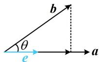

<!-- source-part:1 pages:1-6 -->

# 第 4 节 向量的坐标运算与建系运用（★★★）

## 内容提要

本节归纳与平面向量坐标运算有关的题型.

1. 坐标运算规则

①加减法：设 $a = (x_{1},y_{1})$ ， $\pmb {b} = (x_2,y_2)$ ，则 $\pmb {\alpha}\pm \pmb {b} = (x_{1}\pm x_{2},y_{1}\pm y_{2})$

②数乘：设 $a = (x, y)$ ， $\lambda \in \mathbf{R}$ ，则 $\lambda a = (\lambda x, \lambda y)$ ；

③两点连线向量坐标：设 $A(x_{1},y_{1})$ ， $B(x_{2},y_{2})$ ，则 $\overrightarrow{AB} = (x_2 - x_1,y_2 - y_1)$

④数量积：设 $a = (x_{1},y_{1})$ ， $\pmb {b} = (x_2,y_2)$ ，则 $\pmb {a}\cdot \pmb {b} = x_1x_2 + y_1y_2$

⑤模：设 $a = (x, y)$ ，则 $|a| = \sqrt{x^2 + y^2}$ ；

⑥向量共线坐标公式：设 $a = (x_{1},y_{1})$ ， $\pmb {b} = (x_2,y_2)$ ，则 $a / / b\Leftrightarrow x_1y_2 = x_2y_1$

⑦投影向量计算公式：如图，e 为与 a 同向的单位向量，则 b 在 a 上的投影向量为 $(|b|\cos\theta)e$ ，由于 $e=\frac{a}{|a|}$ ，所以 $(|b|\cos\theta)e=(|b|\cos\theta)\frac{a}{|a|}=\frac{|b|\cos\theta}{|a|}a=\frac{|a|\cdot|b|\cos\theta}{|a|^2}a=\frac{a\cdot b}{|a|^2}a$ .

2. 向量几何问题中的建系方法：在一些几何图形中研究向量问题，若用几何的方法来求解不易，可考虑建系，用向量的坐标运算来解决问题.

3. 向量代数问题中的建系方法：有时题干直接给出几个向量的模、夹角、数量积等条件，没有图形，我们也可以考虑把这些向量放到坐标系下，设出它们的坐标，用向量的坐标运算来解决问题.

![[高中/总复习/教辅/一数常规版2026/第6章 平面向量/第4节 向量的坐标运算与建系运用/类型01_向量的坐标运算/类型01_向量的坐标运算.md]]
![[高中/总复习/教辅/一数常规版2026/第6章 平面向量/第4节 向量的坐标运算与建系运用/类型02_向量几何问题中的建系方法/类型02_向量几何问题中的建系方法.md]]
![[高中/总复习/教辅/一数常规版2026/第6章 平面向量/第4节 向量的坐标运算与建系运用/类型03_向量代数问题中的建系方法/类型03_向量代数问题中的建系方法.md]]
![[高中/总复习/教辅/一数常规版2026/第6章 平面向量/第4节 向量的坐标运算与建系运用/强化训练/强化训练.md]]
