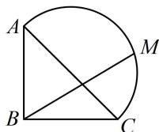

<!-- question-source:start -->
【例4】如图, 在 $\triangle ABC$ 中, $\angle ABC = 90^{\circ}$ , $AB = BC = 1$ , 以 $AC$ 为直径的半圆上有一点 $M$ , $\overrightarrow{BM} = \lambda \overrightarrow{BC} + \sqrt{3} \lambda \overrightarrow{BA}$ , 则 $\lambda = (\quad)$ A. $\frac{\sqrt{3} + 1}{4}$ B. $\frac{\sqrt{3} + 1}{2}$ C. $\frac{\sqrt{3}}{2}$ D. $\sqrt{3}$

<!-- question-source:end -->

![[高中/总复习/教辅/一数常规版2026/第6章 平面向量/第4节 向量的坐标运算与建系运用/类型02_向量几何问题中的建系方法/例题/answers/Q00050364A1.md]]
