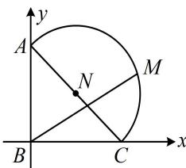

> [!faq]- 《第4节 向量的坐标运算与建系运用》例题解析
>
> > [!success]- **【答案】** A
>
> > [!note]- **【分析】**
> > 本题未单列分析。
>
> > [!note]- **【解析】**
> > 解析：用几何方法分析不易，图形比较特殊，可考虑建系，用向量的坐标运算来解决问题，
> > 建立如图所示的平面直角坐标系，则 $B(0,0)$ ， $A(0,1)$ ， $C(1,0)$ ，AC中点为 $N\left(\frac{1}{2},\frac{1}{2}\right)$ ， $|AC|=\sqrt{2}$ ，
> > 所以图中半圆的方程为 $\left(x-\frac{1}{2}\right)^{2}+\left(y-\frac{1}{2}\right)^{2}=\frac{1}{2}$ ①，
> > 设M(x,y)，则M的坐标满足方程①，且 $\overrightarrow{BM}=(x,y)$ ，而 $\lambda\overrightarrow{BC}+\sqrt{3}\lambda\overrightarrow{BA}=\lambda(1,0)+\sqrt{3}\lambda(0,1)=(\lambda,\sqrt{3}\lambda)$ ，
> > 因为 $\overrightarrow{BM}=\lambda\overrightarrow{BC}+\sqrt{3}\lambda\overrightarrow{BA}$ ，所以 $\begin{cases}x=\lambda\\y=\sqrt{3}\lambda\end{cases}$ 代入①可得 $\left(\lambda-\frac{1}{2}\right)^{2}+\left(\sqrt{3}\lambda-\frac{1}{2}\right)^{2}=\frac{1}{2}$ ，解得： $\lambda=\frac{\sqrt{3}+1}{4}$ 或0，
> > 当 $\lambda=0$ 时M与B重合，不在所给的半圆上，所以 $\lambda=\frac{\sqrt{3}+1}{4}$ .
> >
> > 
>
> > [!tip]- **【反思】**
> > 遇到特殊图形（如直角三角形，等腰、等边三角形，平行四边形，圆等），建系可将思维量较大的几何问题转化为流程化处理的坐标运算问题.
