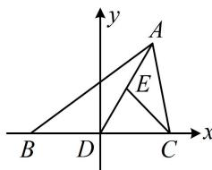

> [!faq]- 《第4节 向量的坐标运算与建系运用》例题解析
>
> > [!success]- **【答案】** B
>
> > [!note]- **【分析】**
> > 本题未单列分析。
>
> > [!note]- **【解析】**
> > A. ①成立;
> > - **②**：成立
> >
> > B. ①成立;
> > - **②**：不成立
> >
> > C. ①不成立;
> > - **②**：成立
> >
> > D. ①不成立;
> > - **②**：不成立
> >
> > 解析：垂直、平行都容易通过坐标运算来判断，故考虑建系． $\triangle ABC$ 形状虽未定，但依然可尝试建系，常取一条边为 $x$ 轴，例如将 $BC$ 放 $x$ 轴上， $BC$ 中点为原点．点 $A$ 位置不确定，故把 $A$ 的坐标设成变量，建立如图所示的平面直角坐标系，不妨设 $B(-1,0)$ ， $C(1,0)$ ， $A(2x,2y)$ ， $y \neq 0$ ，则 $E(x,y)$ ，
> >
> > 所以 $\overrightarrow{AB} = (-1 - 2x, -2y)$ ， $\overrightarrow{CE} = (x - 1,y)$ ，故 $\overrightarrow{AB}\cdot \overrightarrow{CE} = (-1 - 2x)(x - 1) - 2y^2 = -2\left[\left(x - \frac{1}{4}\right)^2 +y^2 -\frac{9}{16}\right]$
> >
> > 上式可以为0，例如，当 $x = \frac{1}{4}$ ， $y = \frac{3}{4}$ 时， $\overrightarrow{AB}\cdot \overrightarrow{CE} = 0$ ，故①成立；
> >
> > $$
> > \overrightarrow {C B} + \overrightarrow {C A} = (- 2, 0) + (2 x - 1, 2 y) = (2 x - 3, 2 y)
> > $$
> >
> > 若 $\overrightarrow{CE} // (\overrightarrow{CB} + \overrightarrow{CA})$ ，则 $(x - 1) \cdot 2y = (2x - 3)y$ ，
> >
> > 
> >
> > 因为 $y \neq 0$ ，所以约去 y 可得 $2(x - 1) = 2x - 3$ ，此方程无解，故②不成立.
>
> > [!tip]- **【反思】**
> > 即使不是特殊图形，有时也可考虑建系来解决问题；对于未定的图形，把坐标设成变量即可.
