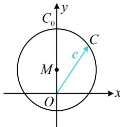

> [!faq]- 《第4节 向量的坐标运算与建系运用》例题解析
>
> > [!success]- **【答案】** $1+\frac{\sqrt{3}}{3}$
>
> > [!note]- **【分析】**
> > 本题未单列分析。
>
> > [!note]- **【解析】**
> > 解析：没图直接分析不易, 而 $a, b$ 的长度夹角均已知, 容易搬进坐标系, 故用坐标翻译条件, 设 $a = (1,0)$ , $b = \left(\frac{1}{2}, \frac{\sqrt{3}}{2}\right)$ , $c = (x,y)$ , 不难验证满足 $|a| = |b| = 1$ , 且 $a, b$ 的夹角为 $60^{\circ}$ , 此时 $a - 2b + 3c = (3x, 3y - \sqrt{3})$ , 所以 $|a - 2b + 3c| \leq 3$ 即为 $\sqrt{9x^{2} + (3y - \sqrt{3})^{2}} \leq 3$ , 化简得: $x^{2} + \left(y - \frac{\sqrt{3}}{3}\right)^{2} \leq 1$ ①, 有了 $x, y$ 满足的关系, 就找到了 $c$ 的终点轨迹. 可画图分析 $|c|$ 的最大值.
> >
> > 有了 $x, y$ 满足的关系，就找到了 $c$ 的终点轨迹，可画图分析 $|c|$ 的最大值，
> >
> > 由①知 c 可以看成从原点 O 出发，指向圆面 $M: x^{2} + \left(y - \frac{\sqrt{3}}{3}\right)^{2} \leq 1$ 上动点 C 的向量，
> > 如图，因为 $\left|OM\right|=\frac{\sqrt{3}}{3}$ ，所以 $\left|c\right|$ 的最大值为 $1+\frac{\sqrt{3}}{3}$ ，此时点 C 与图中 $C_{0}$ 重合.
> >
> >
> > 
>
> > [!tip]- **【反思】**
> > 有时题干没给图形，也可考虑设向量的坐标，把条件翻译为坐标关系，再来解决问题.
