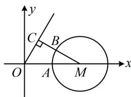

> [!faq]- 《第4节 向量的坐标运算与建系运用》例题解析
>
> > [!success]- **【答案】** D
>
> > [!note]- **【分析】**
> > 本题未单列分析。
>
> > [!note]- **【解析】**
> > 解析：所给条件为代数形式，较抽象，但长度与夹角条件容易搬进坐标系，故考虑用坐标翻译条件，
> >
> > 不妨设 $\boldsymbol{a}=\overrightarrow{OA}=(1,0)$ ， $\cos<\boldsymbol{a},\boldsymbol{c}>=\frac{1}{2}\Rightarrow<\boldsymbol{a},\boldsymbol{c}>=\frac{\pi}{3}$ ，所以可设 $c=\overrightarrow{OC}$ ，且终点 C 在射线 $y=\sqrt{3}x(x>0)$ 上，设 $\boldsymbol{b}=\overrightarrow{OB}=(x,y)$ ，由 $b^{2}-4a\cdot b+3=0$ 可得 $x^{2}+y^{2}-4x+3=0$ ，配方得： $(x-2)^{2}+y^{2}=1$ ①，
> >
> > 条件已翻译完毕，现在可把上述坐标化的结果画到图形中来看，
> >
> > 由①知点 $B$ 可在图中的圆 $M$ 上运动，且 $\left|\pmb {b} - \pmb {c}\right| = \left|\overrightarrow{OB} -\overrightarrow{OC}\right| = \left|\overrightarrow{CB}\right|$ 显然如图所示即为 $\left|\overrightarrow{CB}\right|$ 最小的情形，因为 $M(2,0)$ 到射线 $y = \sqrt{3} x(x > 0)$ 的距离 $\left|MC\right| = \left|OM\right|\sin \angle MOC = 2\sin 60^{\circ} = \sqrt{3}$ 所以 $\left|\pmb {b} - \pmb {c}\right|_{\min} = \sqrt{3} -1.$
> >
> > 
