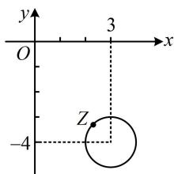

> [!faq]- 《复数》参考答案
>
> > [!success]- **【答案】** D
>
> > [!note]- **【分析】**
> > 本题未单列分析。
>
> > [!note]- **【解析】**
> > 解析：由 $|z - 3 + 4\mathrm{i}| = 1$ 不方便直接求出 $z$ ，故考虑设 $z$ 的代数形式，翻译已知条件来分析，设 $z = x + yi(x,y\in \mathbf{R})$ ，则 $z - 3 + 4\mathrm{i} = x + yi - 3 + 4\mathrm{i}$ $= (x - 3) + (y + 4)\mathrm{i}$ 所以 $\left|z - 3 + 4\mathrm{i}\right| = \sqrt{(x - 3)^2 + (y + 4)^2} = 1,$ 两端平方得 $(x - 3)^2 +(y + 4)^2 = 1$
> >
> > 故复数 $z$ 在复平面上对应的点 $(x,y)$ 的轨迹是以(3,-4)为圆心，1为半径的圆，如图，该圆全部位于第四象限，所以 $z$ 在复平面内对应的点位于第四象限.
> >
> > 
