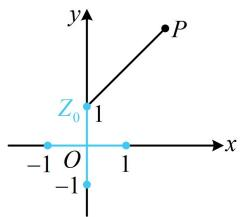

> [!faq]- 《复数》参考答案
>
> > [!success]- **【答案】** $2\sqrt{2}$
>
> > [!note]- **【分析】**
> > 本题未单列分析。
>
> > [!note]- **【解析】**
> > 解析：怎样翻译 $z^2 = (\overline{z})^2$ ？若无思路，不妨设复数 $z$ 的代数形式，再代入分析，设 $z = x + yi(x, y \in \mathbf{R})$ ，则 $\overline{z} = x - yi$ ，因为 $z^2 = (\overline{z})^2$ ，所以 $(x + yi)^2 = (x - yi)^2$ ，故 $x^2 + y^2i^2 + 2xyi = x^2 + y^2i^2 - 2xyi$ ，化简得： $xyi = 0$ ，所以 $x = 0$ 或 $y = 0$ ，
> >
> > 这意味着复数 $z$ 在复平面上对应的点 $Z(x,y)$ 在实轴或虚轴上，题干还给出了 $\left|z\right|\leq 1$ ，由此可进一步限定 $Z$ 的位置，又 $\left|z\right|\leq 1$ ，所以复数 $z$ 在复平面上对应的点 $Z$ 在如图所示的两条蓝色线段上，而 $\left|z - 2 - 3\mathrm{i}\right|$ 表示 $Z$ 与定点 $P(2,3)$ 的距离，所以当 $Z$ 与 $Z_{0}(0,1)$ 重合时，线段 $PZ$ 的长取得最小值 $\sqrt{(2 - 0)^2 + (3 - 1)^2} = 2\sqrt{2}$ ，故 $\left|z - 2 - 3\mathrm{i}\right|_{\min} = 2\sqrt{2}$ ：
> >
> > 
> >
> > 一数·必刷100讲
