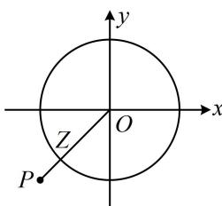

> [!faq]- 《复数》例题解析
>
> > [!success]- **【答案】** A
>
> > [!note]- **【分析】**
> > 本题未单列分析。
>
> > [!note]- **【解析】**
> > 解析：已知的 $|z| = 1$ 和所求的 $|z + 1 + \mathrm{i}|$ 都容易用 $z$ 的代数形式翻译，故设 $z$ 的代数形式来处理，设 $z = x + yi$ ，则 $|z| = \sqrt{x^2 + y^2} = 1$ ，所以 $x^{2} + y^{2} = 1$ ①，
> >
> > $$
> > \left| z + 1 + \mathrm{i} \right| = \left| x + 1 + (y + 1) \mathrm{i} \right| = \sqrt {(x + 1) ^ {2} + (y + 1) ^ {2}}
> > $$
> >
> > 由方程①可知复数 $z$ 在复平面上对应的点 $Z(x,y)$ 在单位圆上运动，式②可看成点 $Z$ 与定点 $P(-1, - 1)$ 的距离，故画图来看，如图，因为 $\left|OP\right| = \sqrt{(-1)^2 + (-1)^2} = \sqrt{2}$ ，所以 $\left|PZ\right|_{\min} = \sqrt{2} -1$ 故 $\left|z + 1 + \mathrm{i}\right|$ 的最小值为 $\sqrt{2} -1$
> >
> > 
>
> > [!tip]- **【反思】**
> > 遇到模的最值问题，可考虑数形结合来分析.
