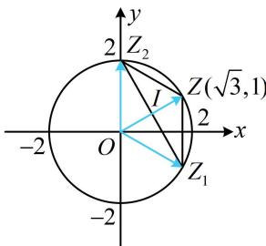

> [!faq]- 《复数》例题解析
>
> > [!success]- **【答案】** $2 \sqrt{3}$
>
> > [!note]- **【分析】**
> > 本题未单列分析。
>
> > [!note]- **【解析】**
> > 解法1: 已知与所求有何关联? 若看不出, 不妨设复数的代数形式, 翻译已知和所求, 再作观察. 由于有 $z_{1} + z_{2} = \sqrt{3} + \mathrm{i}$ , 所以为了减少变量个数, 我们只设 $z_{1}$ , 用上式求 $z_{2}$ ,
> >
> > 设 $z_{1} = x + yi(x,y\in \mathbf{R})$ ，则由 $z_{1} + z_{2} = \sqrt{3} +\mathrm{i}$ 可得 $z_{2} = \sqrt{3} -x + (1 - y)\mathrm{i}$
> >
> > 所以 $z_{1} - z_{2} = 2x - \sqrt{3} + (2y - 1)\mathrm{i}$ ，故 $\left|z_{1} - z_{2}\right| = \sqrt{(2x - \sqrt{3})^{2} + (2y - 1)^{2}} = \sqrt{4(x^{2} + y^{2}) - 4(\sqrt{3} x + y) + 4}$ ①，
> >
> > 条件中还有 $|z_{1}| = |z_{2}| = 2$ 没用到，把它翻译出来，
> >
> > 因为 $\left|z_{1}\right|=\left|z_{2}\right|=2$ ，所以 $\left|z_{1}\right|^{2}=\left|z_{2}\right|^{2}=4$ ，故 $\left\{\begin{aligned}x^{2}+y^{2}&=4②\\\left(\sqrt{3}-x\right)^{2}+(1-y)^{2}&=4③\end{aligned}\right.$
> >
> > 由②③可以解出 $x$ 和 $y$ , 再来算 $\left|z_{1} - z_{2}\right|$ , 但计算量较大, 观察发现①②有共同结构 $x^{2} + y^{2}$ , 若将③展开, 则①③有共同结构 $\sqrt{3} x + y$ , 故按此处理, 看能否整体计算式①,
> >
> > 由③得： $3 - 2\sqrt{3} x + x^2 +1 - 2y + y^2 = 4$ ，结合式②整理得： $\sqrt{3} x + y = 2$ ④，
> >
> > 此时我们发现把②④整体代入①恰好可求得 $\left|z_{1}-z_{2}\right|$ ,
> >
> > 所以 $\left|z_1 - z_2\right| = \sqrt{4(x^2 + y^2) - 4(\sqrt{3}x + y) + 4} = \sqrt{4\times 4 - 4\times 2 + 4} = 2\sqrt{3}$
> >
> > 解法2：看到 $z_{1} + z_{2}$ 和 $z_{1} - z_{2}$ ，想到它们有明确的几何意义，故也可考虑画图分析，设复数 $z_{1}$ ， $z_{2}$ 在复平面对应的点为 $Z_{1}$ ， $Z_{2}$ ，从条件来看， $\overrightarrow{OZ_1}$ 和 $\overrightarrow{OZ_2}$ 的模是已知的，但夹角不知道，夹角由条件 $z_{1} + z_{2} = \sqrt{3} + \mathrm{i}$ 决定，故综合这些信息来分析图形的特征，因为 $z_{1} + z_{2} = \sqrt{3} + \mathrm{i}$ ，所以 $\overrightarrow{OZ_1} + \overrightarrow{OZ_2} = (\sqrt{3}, 1)$ ，
> >
> > 
> >
> > 记 $\overrightarrow{OZ} = \overrightarrow{OZ_1} +\overrightarrow{OZ_2}$ ，则四边形 $OZ_{1}ZZ_{2}$ 为平行四边形，
> >
> > 因为 $\left|\overrightarrow{OZ}\right| = \left|\overrightarrow{OZ_1} +\overrightarrow{OZ_2}\right| = \sqrt{(\sqrt{3})^2 + 1^2} = 2 = \left|\overrightarrow{OZ_1}\right| = \left|\overrightarrow{OZ_2}\right|$ ，所以 $\triangle OZZ_{1}$ 和 $\triangle OZZ_{2}$ 都是边长为2的正三角形，故如图， $|z_1 - z_2| = |\overrightarrow{OZ_1} -\overrightarrow{OZ_2}| = |\overrightarrow{Z_2Z_1}| = 2|\overrightarrow{IZ_1}| = 2|\overrightarrow{OZ_1} |\cdot \sin \angle IOZ_1 = 2\times 2\sin 60^{\circ} = 2\sqrt{3}.$
>
> > [!tip]- **【反思】**
> > 对于模的处理，有代数和几何两种思路。本题是填空题倒数第二题，画图分析显然更优于代数计算，在分析模的时候，可把复数的加减法和向量的加减法对应起来，即 $\left|z_{1}\pm z_{2}\right|=\left|\overrightarrow{OZ_{1}}\pm\overrightarrow{OZ_{2}}\right|$ 。
