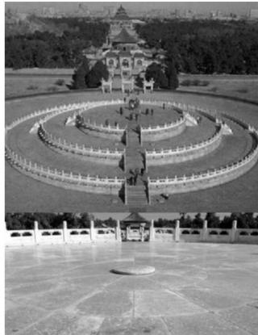

> [!faq]- 《第2节 等差、等比数列的基本性质》例题解析
>
> > [!success]- **【答案】** C
>
> > [!note]- **【分析】**
> > 本题未单列分析。
>
> > [!note]- **【解析】**
> > A. 3699 块 B. 3474 块 C. 3402 块 D. 3339 块
> >
> > 
> >
> > 解析：先把文字信息翻译成数列问题，建立数学模型，
> >
> > 由题意，可设上层从内到外每一环的扇形石板块数分别为 $a_1, a_2, \cdots, a_m$ ，中层分别为 $a_{m+1}, a_{m+2}, \cdots, a_{2m}$ ，下层分别为 $a_{2m+1}, a_{2m+2}, \cdots, a_{3m}$ ，则 $a_1, a_2, \cdots, a_{3m}$ 构成首项 $a_1 = 9$ ，公差 $d = 9$ 的等差数列，设 $\{a_n\}$ 的前 $n$ 项和为 $S_n$ ，注意到上、中、下三层扇形石板块数之和分别为 $S_m$ ， $S_{2m} - S_m$ ， $S_{3m} - S_{2m}$ ，故想到等差数列片段和性质，因为 $\{a_n\}$ 是等差数列，所以 $S_m$ ， $S_{2m} - S_m$ ， $S_{3m} - S_{2m}$ 构成公差为 $m^2 d$ 的等差数列，因为下层比中层多729块，所以 $(S_{3m} - S_{2m}) - (S_{2m} - S_m) = m^2 \times 9 = 729$ ，故 $m = 9$ ，于是每层有9环，三层共有27环，代等差数列前 $n$ 项和公式即可求得问题答案，所以三层共有扇面形石板的块数为 $S_{27} = 27 \times 9 + \frac{27 \times 26}{2} \times 9 = 3402$ 。
>
> > [!tip]- **【总结】**
> > 等差数列问题除了用通项、前 n 项和公式处理外，若能灵活运用有关性质，可降低计算量.
