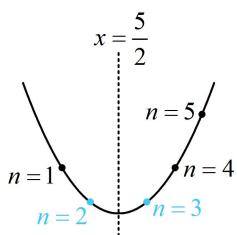

> [!faq]- 《第2节 an与Sn混搭的处理》参考答案
>
> > [!success]- **【答案】** 详见解析
>
> > [!note]- **【分析】**
> > 本题未单列分析。
>
> > [!note]- **【解析】**
> > 解：（1）（要证的是与 $S_{n}$ 有关的结论，故在 $S_{n} = a_{n + 1} - 2^{n}$ 中将 $a_{n + 1}$ 代换成 $S_{n + 1} - S_{n}$ ，消去 $a_{n + 1}$ ）因为 $S_{n} = a_{n + 1} - 2^{n}$ ，所以 $S_{n} = S_{n + 1} - S_{n} - 2^{n}$ ，整理得： $S_{n + 1} = 2S_{n} + 2^{n}$ ①，（要证 $\left\{\frac{S_n}{2^n}\right\}$ 为等差数列，只需证 $\frac{S_{n + 1}}{2^{n + 1}} -\frac{S_n}{2^n}$ 为常数，故先由上式凑出 $\frac{S_{n + 1}}{2^{n + 1}}$ 这种结构）由①两端同除以 $2^{n + 1}$ 得： $\frac{S_{n + 1}}{2^{n + 1}} = \frac{2S_n}{2^{n + 1}} +\frac{2^n}{2^{n + 1}}$ 整理得： $\frac{S_{n + 1}}{2^{n + 1}} -\frac{S_n}{2^n} = \frac{1}{2}$ ，所以 $\left\{\frac{S_n}{2^n}\right\}$ 为等差数列.
> >
> > （2）（要分析不等式 $(n - 6)a_{n}\geq \lambda \cdot 2^{n}$ ，需求出 $a_{n}$ ，可先由第（1）问证得的结论求出 $S_{n}$ ，再求 $a_{n}$ 由（1）得 $\frac{S_n}{2^n} = \frac{S_1}{2^1} +(n - 1)\cdot \frac{1}{2} = \frac{a_1}{2} +\frac{n - 1}{2} = \frac{1}{2} +\frac{n - 1}{2} = \frac{n}{2},$ 所以 $S_{n} = n\cdot 2^{n - 1}$ ，故当 $n\geq 2$ 时， $a_{n} = S_{n} - S_{n - 1} =$ $n\cdot 2^{n - 1} - (n - 1)\cdot 2^{n - 2} = 2n\cdot 2^{n - 2} - (n - 1)\cdot 2^{n - 2} = (n + 1)\cdot 2^{n - 2},$ 又 $a_1 = 1$ 也满足上式，所以 $\forall n\in \mathbf{N}^*$ ， $a_{n} = (n + 1)\cdot 2^{n - 2},$ 故 $(n - 6)a_{n}\geq \lambda \cdot 2^{n}$ 即为 $(n - 6)(n + 1)\cdot 2^{n - 2}\geq \lambda \cdot 2^{n},$ 也即 $\lambda \leq \frac{(n - 6)(n + 1)}{4} = \frac{n^2 - 5n - 6}{4},$
> >
> > （ $\lambda$ 应小于等于右侧的最小值，右侧是关于 $n$ 的二次函数，故通过考虑对称轴来分析其最小值）二次函数 $y = \frac{x^2 - 5x - 6}{4}$ 的对称轴为 $x = \frac{5}{2}$ ，如图，当 $n = 2$ 或3时， $\frac{n^2 - 5n - 6}{4}$ 取得最小值-3，因为 $\lambda \leq \frac{n^2 - 5n - 6}{4}$ 恒成立，所以 $\lambda \leq -3$ ，故 $\lambda_{\max} = -3$ 。
> >
> > 
