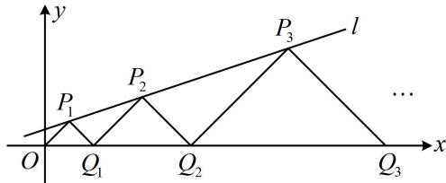

<!-- question-source:start -->
8. (2023·四川模拟·★★★★)

如图，直线 $l: y = \frac{1}{3}x + 1$ 上的点 $P_{i}(i = 1, 2, \cdots, n)$ 与 x 轴正半轴上的点 $Q_{i}(i = 1, 2, \cdots, n)$ 及原点 O 构成一系列等腰直角 $\triangle OP_{1}Q_{1}$ ， $\triangle Q_{1}P_{2}Q_{2}$ ， $\triangle Q_{2}P_{3}Q_{3}$ ，…， $\triangle Q_{n-1}P_{n}Q_{n}$ ，且 $\angle P_{i} = 90^{\circ}(i = 1, 2, \cdots, n)$ ，记点 $Q_{n}$ 的横坐标为 $a_{n}$ ，则 $a_{1} =$ \_\_\_\_ ； $a_{n} =$ \_\_\_\_ .

<!-- question-source:end -->

![[Q00050495A1]]
