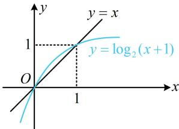

> [!faq]- 《第4节 数列拔高小题专项》参考答案
>
> > [!success]- **【答案】** A
>
> > [!note]- **【分析】**
> > 本题未单列分析。
>
> > [!note]- **【解析】**
> > A
> > 解析： $\{a_{n}\}$ 是递增数列 $\Leftrightarrow a_{n+1} > a_{n}$ 恒成立，
> > 又 $a_{n+1} = \log_{2}(a_{n} + 1)$ ，所以 $\log_{2}(a_{n} + 1) > a_{n}$ ①，
> > 可先由①求出 $a_{n}$ 的范围，这是超越不等式，可画图来看，
> > 函数 $y = \log_{2}(x + 1)$ 和 y = x 的大致图象如图，由图可知不等式①的解集为 $0 < a_{n} < 1$ ；
> > 故问题转化成求当 $0 < a_{n} < 1$ 恒成立时， $a_{1}$ 应满足的范围，
> > 首先， $0 < a_{1} < 1$ ，因为 $a_{2} = \log_{2}(a_{1} + 1)$ ，所以 $0 < a_{2} < 1$ ，
> > 同理， $a_{3}=\log_{2}(a_{2}+1)$ ，所以 $0<a_{3}<1,\cdots,$ 以此类推， $\forall n\in N^{*}$ ，都有 $0<a_{n}<1$ 所以 $a_{1}$ 的取值范围是 (0,1).
> >
> > 
> >
> > 数列 $\{a_{n}\}$ 满足 $a_{n+1}=\frac{1+a_{n}}{1-a_{n}}$ ， $a_{1}=2$ ，若 $T_{n}=a_{1}a_{2}a_{3}\cdots a_{n}$ ，则 $T_{10}=$ \_\_\_\_.
