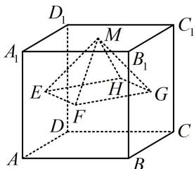

<!-- question-source:start -->
## 2. (2018·天津卷·★★)

已知正方体 $ABCD-A_{1}B_{1}C_{1}D_{1}$ 的棱长为 1，除面 $ABCD$ 外，该正方体其余各面的中心分别为点 $E, F, G, H, M$ （如图），则四棱锥 $M-EFGH$ 的体积为 \_\_\_\_.

<!-- question-source:end -->

![[Q00050506A1]]
