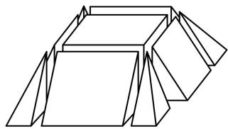

<!-- question-source:start -->
6.（2024·浙江模拟·★★★☆）

如图，将正四棱台切割成九个部分，其中一个部分为长方体，四个部分为直三棱柱，四个部分为四棱锥。已知每个直三棱柱的体积为3，每个四棱锥的体积为1，则该正四棱台的体积为（ ）A. 36 B. 32 C. 28 D. 24

一数·必刷100讲
<!-- question-source:end -->

![[Q00050510A1]]
